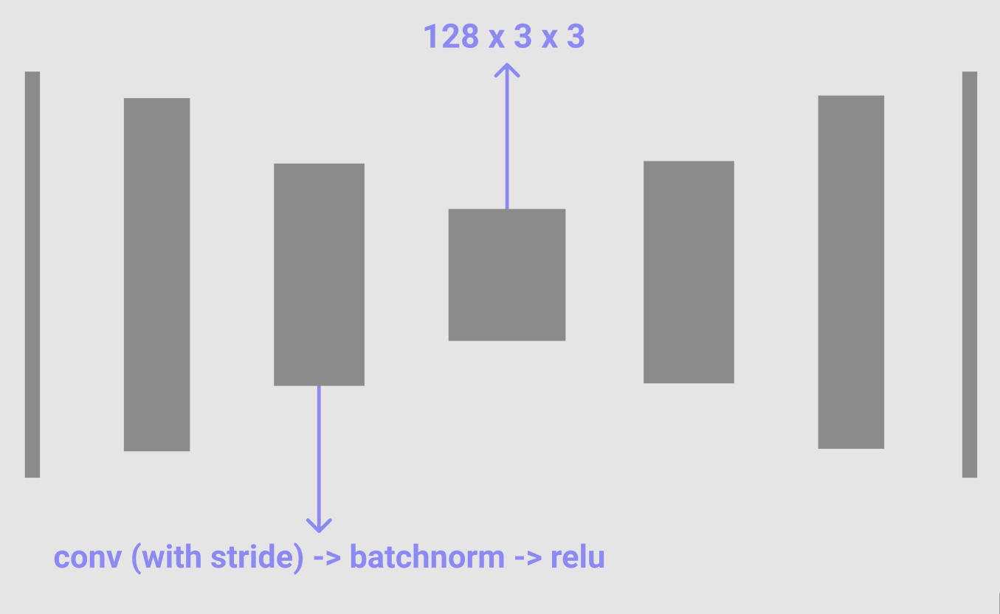
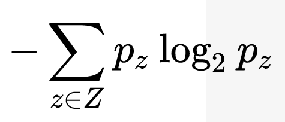
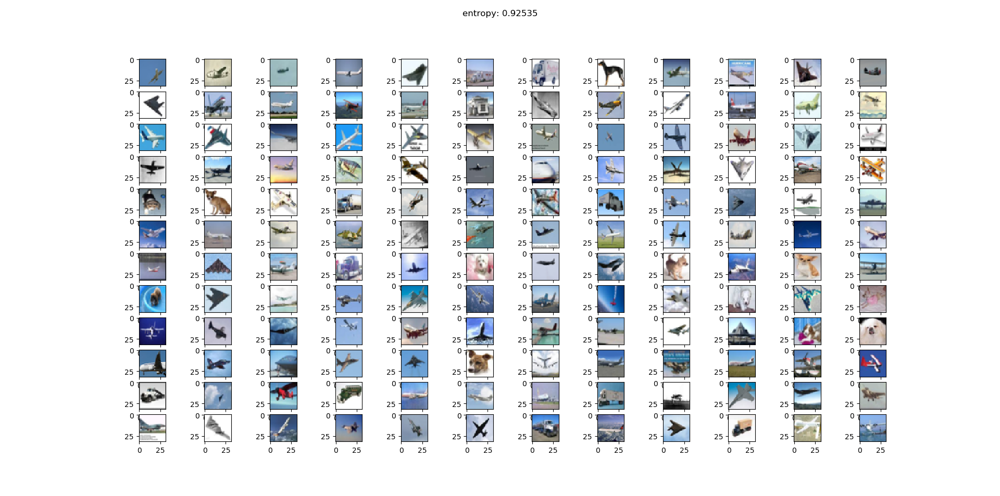
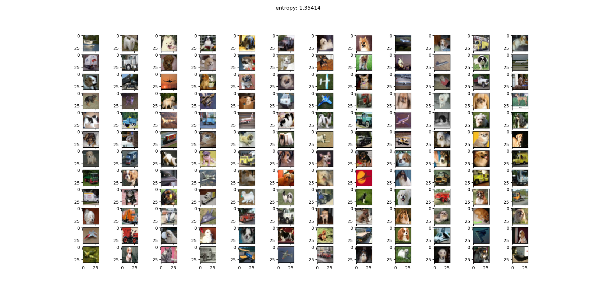
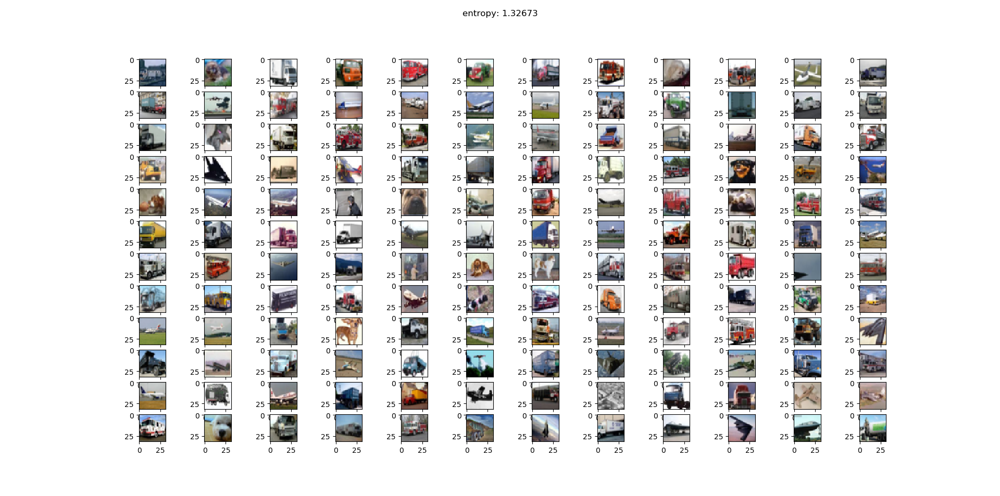

## unsupervised image classification by creating k-means clusters from bottleneck-layers of an autoencoder

## | experiment:

Since the information about what object an image shows is within the image itself, can you compress that certain information using an autoencoder and cluster it to achieve unsupervised image classification?

## | autoencoder:

# | process:
### [autoencoder/](autoencoder/):
The autoencoder was trained to reproduce images out of 3 classes from the CIFAR-10 dataset (dogs, planes and trucks).
After training, the train-dataset was passed through the model again in evaluation mode and the bottleneck layers were saved.

### [k-means-classification/](k-means-classification/):
K-means clustering was applied on the bottleneck-datapoints with K=3, since the amount of classes was fixed.

## | results:

To measure the performance of the clustering, you can calculate the entropy of each cluster. We want every cluster to show (in the perfect case) just one class, therefore the better the clustering the lower the entropy.

 

### examples cluster:

Click to see the clusters

- the first image shows a cluster with mainly planes (lower entropy)
- the second image shows a cluster with most amount of dogs (higher entropy)
- the third image shows a cluster with most amount of trucks (higher entropy)

After training different autoencoders and clustering, it seemed that images where mostly clustered by their colors and less by their objects. Therefore a "plane"-cluster shows more accurate results because the images often have a bright-blue or white background.

